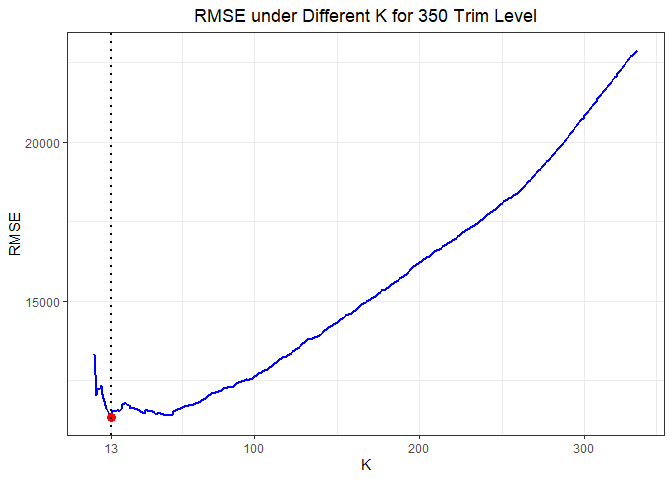
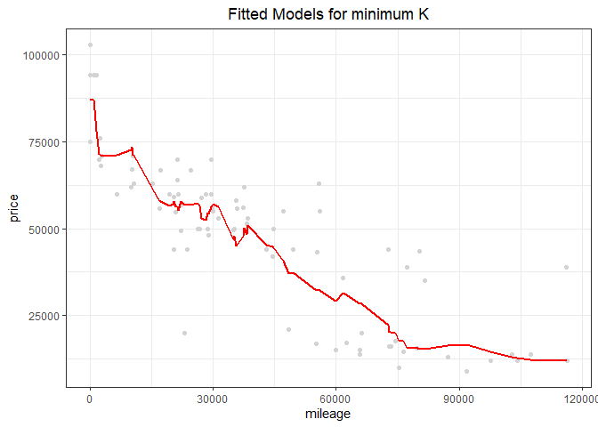

Exercise 1
================
By Eliza Malinova, Zhenghao Li, and Raushan Baizakova

# 1\. Data Visualization: Flights at ABIA

## 1.1 How Does the Airport Traffic Looks Like?

This set of plots looks at the ABIA airport traffic over the course of
the year, days of week and time of the days. As expected, the airport
seems to be the busiest in June and surprisingly it has the least amount
of flights in November if we consider the Thanksgiving holidays. As
expected, the airports are busy in weekdays and had about 25% less
flights on Saturday that on weekdays. If we look at the time of day, the
airport has accepted the largest amount of flights around 17 p.m. with
almost very rare flights after midnight, whereas the flights from Austin
fly mostly around 19 p.m. and 13 p.m..

## 1.2 Which City Has the Most Flights from Austin?

This figure ranks the cities in the US for the flights that occured from
Austin. Not surprisingly, the top three destinations for Austin
originated flights were Texas cities which were twice as frequent than
the majority of other cities.

## 1.3 Are Monthly Average Departure Delay and Arrival Delay Different

In this figure, we look at the mean of arrival and departure delays
separately, to see which months have the highest average delays. In
general, it is expected that departing flights have higher average delay
time than arrivals. If we look at the months, December is a leading
month for both the highest average arrival and departure delays,
although we have found before that relatively it didn’t have the highest
number of flights, which might be explained with the weather conditions
of this month. According to the data, the best time of the year to
minimize both the departure and arrival delays is September, which has
about 3 minutes average departure time and very surprisingly zero
average arrival delay time.

## 1.4 For Every Weekday, Which Month Is the Worst For Travel

The graph displays the average of departure delays for each weekday of
the month. For example, if the traveler is planning on traveling
December on a Saturday, he can expect to encounter a departure delay of
18 minutes on average. However, if a traveler usually travels for
business purposes, he or she would mostly travel on weekdays such as
Mondays or Tuesdays, whose highest expected delays on average occur in
March.

For this graph, the data – ABIA has been grouped first by Month and then
by Day of Week by taking the average of DepDelay for each weekday of the
month. In this way, we can account for the different delays that are
expected for each weekday of the month, since delays tend to vary by
month. There are months in which business travelers dominate such as
March and April, hence the weekdays with high delays will on average be
Monday to Thursday. On the other hand, leisure travelers tend to travel
mostly in December, thus highest delays for this month will be expected
during the weekend.

## 1.5 Which Month Has the Most Extreme Delays

If we look from the perspective of extreme departure delays which is
higher than the 90th percentile - 33 minute of departure delays,
December and July will lead in the length of the time of delays, whereas
March and June have the highest 12 % probability of extreme delay. That
could be explained by our previous finding that these monthes were
leaders in the volume of air traffic in ABIA.

The pie chart displays the probability that the traveler will experience
a delay higher than 33 minutes (the 90th percentile). After filtering
out the delays higher than the the 90th Quantile for the previous graph,
we used that table to count how many flights are in each in month and
divided that by total flights. In this way, the traveler is able to
check what is the probability of having a flight that will be delayed
for more than 33 minutes.

## 1.6 Which City Has the Worst Average Departure Delays

The map shows the airports whose out of Austin flights have the highest
departure delay on average. The darker points indicate higher mean of
departure delay. Here, the darkest point on the map is the DSM airport
with an average departure delay of more than 125 minutes.

To construct the map, we first grouped the ABIA data by destination and
calculated the mean for each destination airport. Afterwards, we used
the airports data from the MUCflights which includes the airport names
abbreviation and the cities where they are located. The airports table
has been joined with the “data” table which includes the mean of delayed
departure by airports. The common column by which the joined has
occurred is the airports name column: “Dest”.

## 1.7 When and How Long to Expect the Delays?

In the following two set of plots, we look at the specific time of the
day and length of delay separately for arrivals and departures. The
longest and the majority of the delays happened from 12:00 p.m. to 02:00
a.m., with less frequent departure delays after midnight, which aligns
with our previous finding that there very rare departing flights at this
time of the day.

## 1.8. What Is The Frequency of the Difference Between Departure Time and Schedule Time

After removing the departure delays above 95th percentile and those
below 5th percentile, we get the distribution of departure delays. If we
focus our attention to the varios departure delay time lengths, we will
find that according to dataset, more than half of the departing flights
from Austin didn’t have delays, but on the contrary departed earlier.

## 1.9 Which Month Has Most Cancellations

If we look at all the cancelled flights in ABIA, we will not be
surprised to see March as a leading month in the number of cancelled
flights followed by April. Particularly, about 2.5% of flights in March
were cancelled.

# 2\. K-nearest neighbors

## 2.1 Look at Price vs Mileage For Each Trim Level

At first, let us have a glimpse of the 350 trim level data and 63AMG
trim level data. The figure 1 is the scatter plot of price and mileage
of 350 trim level cars. In general, the data shows a negative
relationship between price and mileage. However, those points are
separated into two parts: the part in the northwestern area and the part
at the bottom spreading to the right side. It implies that a line
regression may have misspecification for our data. The figure 2 is for
the 65AMG trim level cars. It also shows a negative relationship between
mileage and price.

## 2.2 The Optimal K Vlaue for 350 Trim Level

Our general procedure is as follows: first, splitting the data into
Train subset and Test subset. Based on the estimates of K-nearest
neighbors in Train subset, we get our predications on the Test subset,
and then calculate the RMSE (out-of-sample root mean-squared error).

<!-- --><!-- -->

    ##    Min. 1st Qu.  Median    Mean 3rd Qu.    Max. 
    ##    4.00    9.25   13.00   22.04   27.75   73.00

    ## [1] 378.3249

For 350 trim level, we started from K=3 (K=2 results in an error) to
K=332 (the number of rows in the Train subset). The optimal K is the K
corresponding to the smallest RMSE. Since for each time when we randomly
select a Train subset, the optimal K varies. To be rigorous, we
generated 50 Train subsets, and then got an optimal K for each Train
subset. The first figure shows one of our optimal K and how we got it by
RMSE. The second figure shows the plot of fitted model for this K. The
third figure shows the spread of 50 optimal K’s and its mean (after
taking integer). Then we gave the summary of those 50 optimal K values.

## 2.3 The Optimal K Vlaue for 65AMG Trim Level.

We did the exact same to 65AMG trim level.

    ##    Min. 1st Qu.  Median    Mean 3rd Qu.    Max. 
    ##    3.00    7.25   13.50   18.64   24.75   77.00

    ## [1] 227.6637

Comparing those two summaries of optimal K for 350 trim level and 65AMG
trim level, the 350 trim level has higher mean, median, and variance
(shown above). The main reason is probably that the data of 350 trim
level is more spreading than the data of 65AMG trim level. So to fit the
data, 350 trim level need near points more far away, which requires more
nearest points to lower the RMSE as much as possible.
