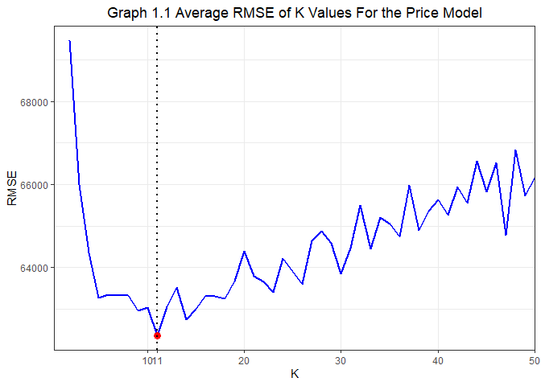
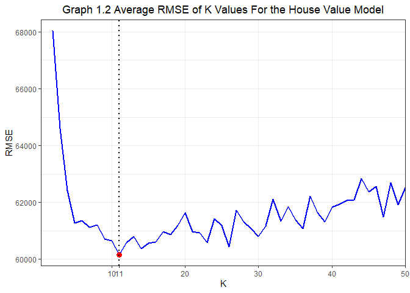

Exercise 2
================

# Problem 1. Saratoga house prices

## Question 1: What model outperforms the “medium” model considered in class?

*Medium Model:* price \~ lotSize + age + livingArea + pctCollege +
bedrooms + fireplaces+bathrooms + rooms + heating + fuel + centralAir

In this exercise, the purpose is to choose a model that outperforms the
above medium model in predicting housing prices based on the dataset
Saratoga. The dataset has 1728 observations and 16 variables including
price, land value, age, rooms, and other house characteristics. The
target variable is the price. Before building models, there is an issue
about the target variable: a housing price consists of the land value
and the house value. The land value is predetermined before a house is
built and is less likely to be affected by those house characteristics.
Moreover, the land value is an intrinsic part of a housing price. So,
generally, the land value should be excluded from our feature variables
to avoid regressing the target variable on a variable that is a part of
the target variable itself. To tackle this issue, we used the following
procedure.

*Step 1.* Use price as the target variable:

1)  Manually build a model that has a lower RMSE than the medium model
    of price;

2)  Use forward selection method to automatically select a model with
    the lowest AIC;

3)  Compare the RMSE of the model manually built and the RMSE of the
    model forward selected, and choose the model with a lower RMSE.

*Step 2.* Generate a new target variable, houseValue, by subtracting
land value from the price:

1)  Build a medium model using houseValue as the target variable and the
    same feature variables as in the medium model of Step 1;

2)  Manually build a model that has a lower RMSE than above medium model
    of house value;

3)  Use forward selection method to automatically select a model with
    the lowest AIC and compare the RMSE of the selected model with the
    RMSE of the manually built model, and choose the model with a lower
    RMSE.

*Step 3.* Compare the chosen model in Step 1 with the chosen model in
Step 2 and use the model with a lower RMSE to help predict the housing
price.

Table 1.1 shows the models we compared in Step 1.

<table class="table" style="margin-left: auto; margin-right: auto;">

<caption>

**Table 1.1 : Models With Price As the Target Variable**

</caption>

<tbody>

<tr>

<td style="text-align:left;">

Baseline Model 1 (Medium Model)

</td>

</tr>

<tr>

<td style="text-align:left;">

price = lotSize + age + livingArea + pctCollege + bedrooms +
fireplaces+bathrooms + rooms + heating + fuel + centralAir

</td>

</tr>

<tr>

<td style="text-align:left;">

Price Model 1 (Manually Built Model)

</td>

</tr>

<tr>

<td style="text-align:left;">

price = rooms + bathrooms + bathrooms*rooms + lotSize +
newConstruction+livingArea + livingArea*rooms + lotSize \* livingArea +
pctCollege + heating + fuel + livingArea \* (heating + fuel) +
centralAir + waterfront

</td>

</tr>

<tr>

<td style="text-align:left;">

Price Model 2 (Forward Selected Model)

</td>

</tr>

<tr>

<td style="text-align:left;">

price = livingArea + landValue + bathrooms + waterfront +
newConstruction + heating + lotSize + age + centralAir + rooms +
bedrooms + landValue \* newConstruction + bathrooms \* heating +
livingArea \* bathrooms + lotSize \* age + livingArea \* waterfront +
landValue \* lotSize + livingArea \* centralAir + age \* centralAir +
livingArea \* landValue + bathrooms \* bedrooms + bathrooms \*
waterfront + heating \* bedrooms + heating \* rooms + waterfront \*
centralAir + waterfront \* lotSize + landValue \* age + age \* rooms +
livingArea \* lotSize + lotSize \* rooms + lotSize \* centralAir

</td>

</tr>

<tr>

<td style="text-align:left;">

Price Model 2.1 (Forward Selected Model without landValue)

</td>

</tr>

<tr>

<td style="text-align:left;">

price = livingArea + bathrooms + waterfront + newConstruction +
heating+lotSize + age + centralAir + rooms + bedrooms + bathrooms \*
heating + livingArea \* bathrooms + lotSize \* age + livingArea \*
waterfront + livingArea \* centralAir + age \* centralAir + bathrooms \*
bedrooms + bathrooms \* waterfront + heating \* bedrooms + heating \*
rooms + waterfront \* centralAir + waterfront \* lotSize + age \*
rooms+livingArea \* lotSize + lotSize \* rooms + lotSize \* centralAir

</td>

</tr>

</tbody>

</table>

All the models are measured by the average out-of-sample RMSE. After
randomly splitting the dataset into a train data set and a test dataset,
we ran three models in the train dataset, and then used the test dataset
to get an out-of-sample RMSE for each model. We repeated this procedure
for 100 times and then took the average of all out-of-sample RMSE. The
average out-of-sample RMSE are listed in the following table.

<table class="table" style="width: auto !important; margin-left: auto; margin-right: auto;">

<caption>

**Table 1.2 : RMSE for Price Models of Step 1**

</caption>

<tbody>

<tr>

<td style="text-align:left;width: 10em; ">

Baseline Model 1

</td>

<td style="text-align:right;">

66303.97

</td>

</tr>

<tr>

<td style="text-align:left;width: 10em; ">

Price Model 1

</td>

<td style="text-align:right;">

63763.09

</td>

</tr>

<tr>

<td style="text-align:left;width: 10em; ">

Price Model 2

</td>

<td style="text-align:right;">

58497.46

</td>

</tr>

<tr>

<td style="text-align:left;width: 10em; ">

Price Model 2.1

</td>

<td style="text-align:right;">

65030.77

</td>

</tr>

</tbody>

</table>

According to the above table, the Price Model 2 has the lowest average
out-of-sample (usually around 58000, sometimes even below 57000).
However, the Price Model 2 includes the variable landValue as a feature
variable, which is a part of price. Therefore, the low RMSE of Price
Model 2 is probably from using a part of the target variable to explain
the outcome, which disturbs the assessment of the predictive abilities
of the feature variables. To see that, we ran the Price Model 2 after
removing landValue and its interactions with other feature variables on
the right-hand side. The resulted RMSE (of Price Model 2.1) increased to
around 64000, though still lower than the Baseline Model 1.

To address this problem, we implemented the Step 2, building three
models with the houseValue as the target variable, as shown in Table 1.3

<table class="table" style="margin-left: auto; margin-right: auto;">

<caption>

**Table 1.3 : Models With houseValue As the Target Variable**

</caption>

<tbody>

<tr>

<td style="text-align:left;">

Baseline Model 2 (Medium Model of houseValue)

</td>

</tr>

<tr>

<td style="text-align:left;">

houseValue = lotSize + age + livingArea + pctCollege + bedrooms +
fireplaces + bathrooms + rooms + heating + fuel + centralAir

</td>

</tr>

<tr>

<td style="text-align:left;">

House Value Model 1 (Manually Built Model)

</td>

</tr>

<tr>

<td style="text-align:left;">

houseValue = landValue + rooms + bathrooms + bathrooms*rooms + lotSize +
newConstruction+ livingArea + livingArea * rooms+lotSize \* livingArea +
pctCollege + heating + fuel +livingArea \* heating + livingArea \*
fuel+centralAir + waterfront

</td>

</tr>

<tr>

<td style="text-align:left;">

House Value Model 2 (Forward Selected Model)

</td>

</tr>

<tr>

<td style="text-align:left;">

houseValue = livingArea + bathrooms + waterfront + newConstruction +
heating + lotSize + age + rooms + centralAir + landValue + bedrooms +
bathrooms \* heating + livingArea \* bathrooms + lotSize \* age +
livingArea \* newConstruction + livingArea \* waterfront + livingArea \*
centralAir + age \* centralAir + newConstruction \* landValue + lotSize
\* landValue + livingArea \* landValue + bathrooms \* bedrooms +
bathrooms \* newConstruction + heating \* bedrooms + heating \* rooms +
bathrooms \* waterfront + waterfront \* centralAir + waterfront \*
lotSize + age \* landValue + age \* rooms + livingArea \* lotSize +
lotSize \* rooms + lotSize \* centralAir

</td>

</tr>

</tbody>

</table>

The Baseline Model 2 has the same feature variables as the Baseline
Model 1. The main difference between HouseValue Model 1 and Price Model
1 is that HouseValue Model 1 includes landvalue but Price Model 1 does
not. We are now free to include landvalue as a feature variable since it
is not part of the target variable anymore.

House Value Model 2 was picked by the forward selection. The average
out-of-sample RMSE are shown in Table 1.4.

<table>

<caption>

**Table 1.4 : RMSE for HouseValue Models of Step 2**

</caption>

<tbody>

<tr>

<td style="text-align:left;">

Baseline Model 2

</td>

<td style="text-align:right;">

60474.87

</td>

</tr>

<tr>

<td style="text-align:left;">

House Value Model 1

</td>

<td style="text-align:right;">

58586.70

</td>

</tr>

<tr>

<td style="text-align:left;">

House Value Model 2

</td>

<td style="text-align:right;">

58745.08

</td>

</tr>

</tbody>

</table>

The results show that the House Value Model 1 and House Value Model 2
both have the average out-of-sample RMSE around 59000. This value is
much lower than that of Price Model 2.1, but close to that of Price
Model 2 that regresses price on landValue and other characteristics.

Therefore, based on the average out-of-sample RMSE, we can choose either
House Value Model 1 or House Value Model 2. If we prefer a more
parsimonious model, House Value Model 1 is to be selected. If preferring
a lower AIC, House Value Model 2 is to be selected since forward
selection in default returns the model with the lowest AIC. But both
have much lower RMSE than the Baseline Model 2 as well as Baseline Model
1.

Note that since HouseValue models predict house values nor house prices,
we need to add those corresponding land values to predicted house values
when predicting prices.

## Question 2: Which Variables or Interactions Drive Prices More?

In this part, we decide to use a more parsimonious model, House Value
Model 1, to examine feature variables’ coefficients. To see which
variables and interactions are extremely strong in driving the price, we
list the estimates of coefficients in the Table 1.5.

<table style="border-collapse:collapse; border:none;">

<caption style="font-weight: bold; text-align:left;">

**Table 1.5 Coefficients of House Value Model 1**

</caption>

<tr>

<th style="border-top: double; text-align:center; font-style:normal; font-weight:bold; padding:0.2cm;  text-align:left; ">

 

</th>

<th colspan="3" style="border-top: double; text-align:center; font-style:normal; font-weight:bold; padding:0.2cm; ">

House Value Model 1

</th>

</tr>

<tr>

<td style=" text-align:center; border-bottom:1px solid; font-style:italic; font-weight:normal;  text-align:left; ">

Predictors

</td>

<td style=" text-align:center; border-bottom:1px solid; font-style:italic; font-weight:normal;  ">

Coefficients

</td>

<td style=" text-align:center; border-bottom:1px solid; font-style:italic; font-weight:normal;  ">

CI

</td>

<td style=" text-align:center; border-bottom:1px solid; font-style:italic; font-weight:normal;  ">

p

</td>

</tr>

<tr>

<td style=" padding:0.2cm; text-align:left; vertical-align:top; text-align:left; ">

(Intercept)

</td>

<td style=" padding:0.2cm; text-align:left; vertical-align:top; text-align:center;  ">

110769.68

</td>

<td style=" padding:0.2cm; text-align:left; vertical-align:top; text-align:center;  ">

62637.15 – 158902.20

</td>

<td style=" padding:0.2cm; text-align:left; vertical-align:top; text-align:center;  ">

<strong>\<0.001

</td>

</tr>

<tr>

<td style=" padding:0.2cm; text-align:left; vertical-align:top; text-align:left; ">

landValue

</td>

<td style=" padding:0.2cm; text-align:left; vertical-align:top; text-align:center;  ">

\-0.13

</td>

<td style=" padding:0.2cm; text-align:left; vertical-align:top; text-align:center;  ">

\-0.22 – -0.04

</td>

<td style=" padding:0.2cm; text-align:left; vertical-align:top; text-align:center;  ">

<strong>0.005</strong>

</td>

</tr>

<tr>

<td style=" padding:0.2cm; text-align:left; vertical-align:top; text-align:left; ">

rooms

</td>

<td style=" padding:0.2cm; text-align:left; vertical-align:top; text-align:center;  ">

\-3657.47

</td>

<td style=" padding:0.2cm; text-align:left; vertical-align:top; text-align:center;  ">

\-7761.11 – 446.18

</td>

<td style=" padding:0.2cm; text-align:left; vertical-align:top; text-align:center;  ">

0.081

</td>

</tr>

<tr>

<td style=" padding:0.2cm; text-align:left; vertical-align:top; text-align:left; ">

bathrooms

</td>

<td style=" padding:0.2cm; text-align:left; vertical-align:top; text-align:center;  ">

14342.88

</td>

<td style=" padding:0.2cm; text-align:left; vertical-align:top; text-align:center;  ">

\-5163.90 – 33849.66

</td>

<td style=" padding:0.2cm; text-align:left; vertical-align:top; text-align:center;  ">

0.149

</td>

</tr>

<tr>

<td style=" padding:0.2cm; text-align:left; vertical-align:top; text-align:left; ">

lotSize

</td>

<td style=" padding:0.2cm; text-align:left; vertical-align:top; text-align:center;  ">

16844.56

</td>

<td style=" padding:0.2cm; text-align:left; vertical-align:top; text-align:center;  ">

5332.89 – 28356.23

</td>

<td style=" padding:0.2cm; text-align:left; vertical-align:top; text-align:center;  ">

<strong>0.004</strong>

</td>

</tr>

<tr>

<td style=" padding:0.2cm; text-align:left; vertical-align:top; text-align:left; ">

newConstruction \[No\]

</td>

<td style=" padding:0.2cm; text-align:left; vertical-align:top; text-align:center;  ">

51049.22

</td>

<td style=" padding:0.2cm; text-align:left; vertical-align:top; text-align:center;  ">

36874.69 – 65223.74

</td>

<td style=" padding:0.2cm; text-align:left; vertical-align:top; text-align:center;  ">

<strong>\<0.001

</td>

</tr>

<tr>

<td style=" padding:0.2cm; text-align:left; vertical-align:top; text-align:left; ">

livingArea

</td>

<td style=" padding:0.2cm; text-align:left; vertical-align:top; text-align:center;  ">

65.82

</td>

<td style=" padding:0.2cm; text-align:left; vertical-align:top; text-align:center;  ">

42.13 – 89.52

</td>

<td style=" padding:0.2cm; text-align:left; vertical-align:top; text-align:center;  ">

<strong>\<0.001

</td>

</tr>

<tr>

<td style=" padding:0.2cm; text-align:left; vertical-align:top; text-align:left; ">

pctCollege

</td>

<td style=" padding:0.2cm; text-align:left; vertical-align:top; text-align:center;  ">

\-107.08

</td>

<td style=" padding:0.2cm; text-align:left; vertical-align:top; text-align:center;  ">

\-397.50 – 183.34

</td>

<td style=" padding:0.2cm; text-align:left; vertical-align:top; text-align:center;  ">

0.470

</td>

</tr>

<tr>

<td style=" padding:0.2cm; text-align:left; vertical-align:top; text-align:left; ">

heating \[hot water/steam\]

</td>

<td style=" padding:0.2cm; text-align:left; vertical-align:top; text-align:center;  ">

40378.72

</td>

<td style=" padding:0.2cm; text-align:left; vertical-align:top; text-align:center;  ">

16844.61 – 63912.84

</td>

<td style=" padding:0.2cm; text-align:left; vertical-align:top; text-align:center;  ">

<strong>0.001</strong>

</td>

</tr>

<tr>

<td style=" padding:0.2cm; text-align:left; vertical-align:top; text-align:left; ">

heating \[electric\]

</td>

<td style=" padding:0.2cm; text-align:left; vertical-align:top; text-align:center;  ">

62614.18

</td>

<td style=" padding:0.2cm; text-align:left; vertical-align:top; text-align:center;  ">

\-31659.62 – 156887.97

</td>

<td style=" padding:0.2cm; text-align:left; vertical-align:top; text-align:center;  ">

0.193

</td>

</tr>

<tr>

<td style=" padding:0.2cm; text-align:left; vertical-align:top; text-align:left; ">

fuel \[electric\]

</td>

<td style=" padding:0.2cm; text-align:left; vertical-align:top; text-align:center;  ">

\-48188.87

</td>

<td style=" padding:0.2cm; text-align:left; vertical-align:top; text-align:center;  ">

\-141796.02 – 45418.28

</td>

<td style=" padding:0.2cm; text-align:left; vertical-align:top; text-align:center;  ">

0.313

</td>

</tr>

<tr>

<td style=" padding:0.2cm; text-align:left; vertical-align:top; text-align:left; ">

fuel \[oil\]

</td>

<td style=" padding:0.2cm; text-align:left; vertical-align:top; text-align:center;  ">

36711.17

</td>

<td style=" padding:0.2cm; text-align:left; vertical-align:top; text-align:center;  ">

11086.20 – 62336.14

</td>

<td style=" padding:0.2cm; text-align:left; vertical-align:top; text-align:center;  ">

<strong>0.005</strong>

</td>

</tr>

<tr>

<td style=" padding:0.2cm; text-align:left; vertical-align:top; text-align:left; ">

centralAir \[No\]

</td>

<td style=" padding:0.2cm; text-align:left; vertical-align:top; text-align:center;  ">

\-11437.89

</td>

<td style=" padding:0.2cm; text-align:left; vertical-align:top; text-align:center;  ">

\-18106.76 – -4769.02

</td>

<td style=" padding:0.2cm; text-align:left; vertical-align:top; text-align:center;  ">

<strong>0.001</strong>

</td>

</tr>

<tr>

<td style=" padding:0.2cm; text-align:left; vertical-align:top; text-align:left; ">

waterfront \[No\]

</td>

<td style=" padding:0.2cm; text-align:left; vertical-align:top; text-align:center;  ">

\-124358.87

</td>

<td style=" padding:0.2cm; text-align:left; vertical-align:top; text-align:center;  ">

\-154491.25 – -94226.49

</td>

<td style=" padding:0.2cm; text-align:left; vertical-align:top; text-align:center;  ">

<strong>\<0.001

</td>

</tr>

<tr>

<td style=" padding:0.2cm; text-align:left; vertical-align:top; text-align:left; ">

rooms \* bathrooms

</td>

<td style=" padding:0.2cm; text-align:left; vertical-align:top; text-align:center;  ">

1501.79

</td>

<td style=" padding:0.2cm; text-align:left; vertical-align:top; text-align:center;  ">

\-1052.60 – 4056.17

</td>

<td style=" padding:0.2cm; text-align:left; vertical-align:top; text-align:center;  ">

0.249

</td>

</tr>

<tr>

<td style=" padding:0.2cm; text-align:left; vertical-align:top; text-align:left; ">

rooms \* livingArea

</td>

<td style=" padding:0.2cm; text-align:left; vertical-align:top; text-align:center;  ">

1.55

</td>

<td style=" padding:0.2cm; text-align:left; vertical-align:top; text-align:center;  ">

\-1.09 – 4.19

</td>

<td style=" padding:0.2cm; text-align:left; vertical-align:top; text-align:center;  ">

0.250

</td>

</tr>

<tr>

<td style=" padding:0.2cm; text-align:left; vertical-align:top; text-align:left; ">

lotSize \* livingArea

</td>

<td style=" padding:0.2cm; text-align:left; vertical-align:top; text-align:center;  ">

\-4.21

</td>

<td style=" padding:0.2cm; text-align:left; vertical-align:top; text-align:center;  ">

\-9.92 – 1.49

</td>

<td style=" padding:0.2cm; text-align:left; vertical-align:top; text-align:center;  ">

0.148

</td>

</tr>

<tr>

<td style=" padding:0.2cm; text-align:left; vertical-align:top; text-align:left; ">

livingArea \* heating \[hot water/steam\]

</td>

<td style=" padding:0.2cm; text-align:left; vertical-align:top; text-align:center;  ">

\-29.83

</td>

<td style=" padding:0.2cm; text-align:left; vertical-align:top; text-align:center;  ">

\-42.06 – -17.60

</td>

<td style=" padding:0.2cm; text-align:left; vertical-align:top; text-align:center;  ">

<strong>\<0.001

</td>

</tr>

<tr>

<td style=" padding:0.2cm; text-align:left; vertical-align:top; text-align:left; ">

livingArea \* heating \[electric\]

</td>

<td style=" padding:0.2cm; text-align:left; vertical-align:top; text-align:center;  ">

\-38.58

</td>

<td style=" padding:0.2cm; text-align:left; vertical-align:top; text-align:center;  ">

\-93.25 – 16.08

</td>

<td style=" padding:0.2cm; text-align:left; vertical-align:top; text-align:center;  ">

0.166

</td>

</tr>

<tr>

<td style=" padding:0.2cm; text-align:left; vertical-align:top; text-align:left; ">

livingArea \* fuel \[electric\]

</td>

<td style=" padding:0.2cm; text-align:left; vertical-align:top; text-align:center;  ">

24.00

</td>

<td style=" padding:0.2cm; text-align:left; vertical-align:top; text-align:center;  ">

\-29.96 – 77.96

</td>

<td style=" padding:0.2cm; text-align:left; vertical-align:top; text-align:center;  ">

0.383

</td>

</tr>

<tr>

<td style=" padding:0.2cm; text-align:left; vertical-align:top; text-align:left; ">

livingArea \* fuel \[oil\]

</td>

<td style=" padding:0.2cm; text-align:left; vertical-align:top; text-align:center;  ">

\-26.60

</td>

<td style=" padding:0.2cm; text-align:left; vertical-align:top; text-align:center;  ">

\-41.17 – -12.03

</td>

<td style=" padding:0.2cm; text-align:left; vertical-align:top; text-align:center;  ">

<strong>\<0.001

</td>

</tr>

</table>

A brief look tells us that those variables and interactions with
significant coefficients can be candidates of extremely strong drivers
of prices. Such variables include the size of lot (lotSize), if the
house is newly constructed (newConstructionNo), the living area, type of
heating system (hot water/steam and electric), the sources of heating
(fuel), if a house includes waterfront (waterfrontNo), and the
interactions between the living area and heating as well as the living
area and fuel.

To decide their relative strength in driving prices, we ran nine
different modifications of the House Value Model 1 but for each of the
nine models we excluded the specific variable of interest from the House
Value Model 1. Afterwards, we got the average out-of-sample RMSE for
each of these 9 models. The higher the average out-of-sample RMSE of a
model relative to that of the House Value Model 1, the stronger is that
excluded variable as a price driver. We subtracted the House Value Model
1’s average RMSE from each of the nine models’ average RMSE to see the
impact of the excluded variables. The results are shown in Table 1.6

<table>

<caption>

**Table 1.6 Use Changes in RMSE to Evaluate Price Drivers**

</caption>

<tbody>

<tr>

<td style="text-align:left;">

lotSize

</td>

<td style="text-align:right;">

0.00

</td>

</tr>

<tr>

<td style="text-align:left;">

NewConstruction

</td>

<td style="text-align:right;">

787.31

</td>

</tr>

<tr>

<td style="text-align:left;">

livingArea

</td>

<td style="text-align:right;">

0.00

</td>

</tr>

<tr>

<td style="text-align:left;">

heating

</td>

<td style="text-align:right;">

0.00

</td>

</tr>

<tr>

<td style="text-align:left;">

fuel

</td>

<td style="text-align:right;">

0.00

</td>

</tr>

<tr>

<td style="text-align:left;">

waterfront

</td>

<td style="text-align:right;">

1248.81

</td>

</tr>

<tr>

<td style="text-align:left;">

centralAir

</td>

<td style="text-align:right;">

141.51

</td>

</tr>

<tr>

<td style="text-align:left;">

livingArea\*heating

</td>

<td style="text-align:right;">

322.52

</td>

</tr>

<tr>

<td style="text-align:left;">

livingArea\*fuel

</td>

<td style="text-align:right;">

211.21

</td>

</tr>

</tbody>

</table>

From the difference in RMSE, we can see that five variables have very
strong impact on prices: waterfront, newConstruction, livingArea \*
heating, and livingArea \* fuel and centralAir. Other variables are not
strong drivers of prices from the a perspective of RMSE.

Hence, coefficients and RMSE tell us some different results about which
variables and interactions are driving prices more. By coefficients,
variables like lotSize, heaing, and fuel are strong in driving prices
while according to the RMSE they have no such significant impact on
prices. And variables like livingArea \* heating are important to drive
prices based on RMSE but their magnitudes are too small from the
perspective of coefficients. Combining the results of two approaches, it
may be less disputable to conclude that waterfront, newConstruction, and
centralAir are three most important factors in driving prices.

## Question 3: The Performance of KNN Method

Now we use KNN regression to predict prices. The approach is similar:
first, use price as the target variable, then use house value as the
target variable, at last, choose the model (i.e. choose the value of K)
with a lower RMSE and compare it with the RMSE we have gotten in Q 1.1.
A special aspect in KNN regression is that since the distances between K
points are very sensitive to the magnitudes of variables, all the
variables have to be standardized by their standard deviations at first.
Except that, the whole procedure is the same as in linear regression.
Table 6 shows the lowest average out-of-sample RMSE and corresponding K
values for price KNN model and house value KNN model. We also show how
the average out-of-sample RMSE vary with the different values of K in
Graph 1 (for price model) and Graph 2 (for house value model).

<table>

<caption>

**Table 1.7 Minimum RMSE and Corresponding K**

</caption>

<thead>

<tr>

<th style="text-align:left;">

Models

</th>

<th style="text-align:right;">

Minimum Mean

</th>

<th style="text-align:right;">

K

</th>

</tr>

</thead>

<tbody>

<tr>

<td style="text-align:left;">

The Price Model

</td>

<td style="text-align:right;">

62364.11

</td>

<td style="text-align:right;">

11

</td>

</tr>

<tr>

<td style="text-align:left;">

The House Value Model

</td>

<td style="text-align:right;">

60165.06

</td>

<td style="text-align:right;">

11

</td>

</tr>

</tbody>

</table>

Based on above table and graph, we can conclude: first, house value KNN
model has a lower “lowest average out-of-sample RMSE”. So similar to the
case of the linear model, house value also performs better as a target
variable in KNN regression. Second, compared to linear models with the
price as the target variable, the price KNN regression has a lower
minimum average out-of-sample RMSE for some K values. However, compared
to linear models with the house value as the target variable, house
value KNN doesn’t perform better since its minimum average out-of-sample
is usually higher than that of the linear model. Therefore, based on the
RMSE as a measurement of the model performance in predicting house
prices, linear model is a better choice if the target variable is a
house value, while the KNN regression is better if the target value is
the price. Generally, from the perspectives of a lower RMSE than the
“medium” model’s RMSE, this report suggests using House Value Model 1
to predict the market values of properties. We recommend House Value
Model 1 because this model is more parsimonious and more reasonable than
House Value Model 2, even though House Value Model 2 has a slightly
lower average RMSE.
